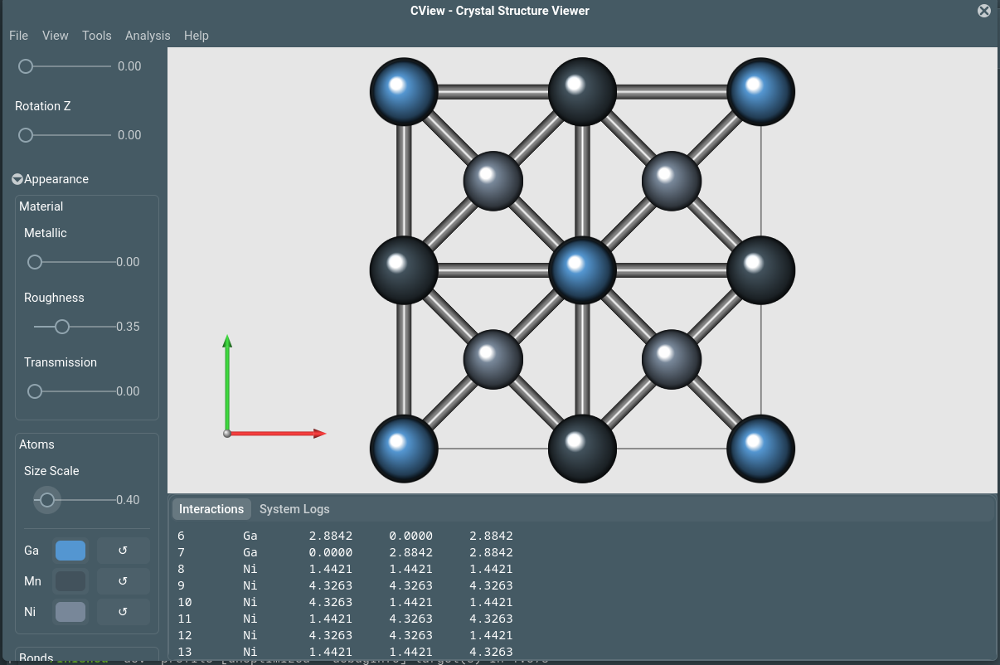

# CView: Ab-initio K-Path Visualization & Structure Analysis


**CView** is a high-performance, **open-source** crystallographic tool written in Rust and GTK4. It is designed to bridge the gap between structure visualization and *ab-initio* calculation setup (VASP, QE, SPRKKR).

Unlike standard viewers, CView focuses on **Reciprocal Space Analysis** and **Geometric Manipulation** (Slabs, Supercells, Voids), providing immediate visual validation for inputs before running expensive DFT calculations.


*(Note: Please ensure you place a screenshot at `docs/images/screenshot_main.png`)*

---

## 🔬 Scientific Methodology

CView implements rigorous algorithms to ensure physical accuracy for computational physics workflows.

### 1. Reciprocal Space & K-Paths
* **Brillouin Zone Construction:** The First Brillouin Zone is generated using a **Voronoi Vertex Enumeration** algorithm on the reciprocal lattice vectors. This correctly handles complex truncations (e.g., Truncated Octahedron for FCC, Dodecahedron for Rhombohedral).
* **Path Selection:** High-Symmetry Points (HSP) are automatically assigned based on the Space Group using the **Setyawan-Curtarolo convention**.
* **Validation:** Paths are visualized in 3D to ensure they pass through face centers ($X, L$) or edges ($K, W$) correctly.

### 2. Surface Slab Generation
* **Algorithm:** Slabs are generated by performing a **Basis Transformation**. The code identifies two primitive vectors $(u, v)$ lying in the specified Miller Plane $(hkl)$ and a stacking vector $(w)$.
* **Vacuum Padding:** The unit cell is expanded along the surface normal ($c$-axis) to break periodicity for surface science calculations.
* **Sanity Check:** Automatically handles dipole corrections by centering the slab within the vacuum (optional).

### 3. X-Ray Diffraction (XRD) Simulation
* **Intensity Calculation:** Peak intensities are derived from the **Structure Factor** formalism:
    $$I \propto |F_{hkl}|^2 \cdot LP(\theta)$$
    Where $F_{hkl}$ is the structure factor summed over all atoms $j$:
    $$F_{hkl} = \sum_{j} f_j \exp[2\pi i (hx_j + ky_j + lz_j)]$$
* **Corrections:** Includes the **Lorentz-Polarization (LP) factor** for powder diffraction:
    $$LP(\theta) = \frac{1 + \cos^2(2\theta)}{\sin^2(\theta)\cos(\theta)}$$
* **Output:** Generates $2\theta$ vs. Intensity plots suitable for comparing theoretical structures against experimental patterns.

### 4. Void & Intercalation Analysis
* **Grid Method:** The unit cell is discretized into a high-resolution 3D grid.
* **Probe Analysis:** A geometric probe (radius $r_{probe}$) is passed through the grid. A point is considered "void" if its distance to all atoms $i$ satisfies:
    $$d_i > r_{vdw, i} + r_{probe}$$
* **Applications:** Identifies potential intercalation sites (e.g., for Li-ion batteries) or porous channels in MOFs.

---

## 🌟 Key Features

### 1. True Cross-Platform Portability
* **Run Anywhere:** Built on the **Rust** toolchain and **GTK4**, CView is strictly cross-platform.
* **No Proprietary Drivers:** It runs natively on **Linux, Windows, macOS, and BSD** systems—anywhere `cargo` and `gtk4` can be installed.
* **Lightweight:** Uses CPU-based Cairo rendering, meaning it runs efficiently on standard laptops without requiring dedicated GPU drivers.

### 2. Robust Symmetry Handling
* **Spglib/Moyo Integration:** Robust space group detection (International & Hall symbols).
* **Cell Standardization:** Automatically transforms primitive cells (e.g., Rhombohedral Bi₂Se₃) into standard conventional cells (Hexagonal) using rigorous basis transformations.

### 3. Supercell & Defect Generation
* **Supercell Generator:** Create arbitrary $N_x \times N_y \times N_z$ supercells for defect studies or magnetic ordering.
* **Intercalation Search:** Identify valid interstitial sites for doping studies.

### 4. Publication-Ready Rendering
* **Physics-Based Rendering (PBR):** Metallic, roughness, and transmission parameters for high-fidelity atom visualization.
* **Vector Export:** Export scenes as high-resolution PDFs or transparent PNGs suitable for journal figures.

---

## 📂 Supported File Formats

CView automatically detects file types based on extension and content.

| Code / Format | Extensions | Notes |
| :--- | :--- | :--- |
| **VASP** | `POSCAR`, `CONTCAR`, `.vasp` | Standard VASP structure files. |
| **Quantum Espresso** | `.in`, `.pwi`, `.qe` | Reads `CELL_PARAMETERS` and `ATOMIC_POSITIONS`. |
| **QE Output** | `.out`, `.log` | **Relaxation Aware:** Automatically extracts the *final* relaxed structure from `vc-relax` logs. |
| **SPRKKR** | `.inp`, `.sys`, `.pot` | Support for Munich SPR-KKR input formats. |
| **CIF** | `.cif` | Standard Crystallographic Information File. |
| **XYZ** | `.xyz` | Supports standard XYZ and **Extended XYZ** (Lattice line in comment). |

---

## 🚀 Installation

### System Requirements
* **OS:** Linux, Windows, or macOS
* **Graphics:** Standard desktop graphics (Integrated GPU sufficient).
* **Build Tools:** Rust toolchain (`cargo`) and GTK4 development libraries.

### Building from Source
```bash
# Clone the repository
git clone [https://github.com/mavensgroup/cview.git](https://github.com/mavensgroup/cview.git)
cd cview
```

### Build and run with optimizations
```bash
cargo run --release
```

---
## ❓ Troubleshooting
1. Q: The XRD peaks look sharp/delta-like.
    - A: The current implementation calculates integrated intensities. A Gaussian/Lorentzian broadening feature is planned for v1.1.Q: Slab generation fails for high-index planes.A: Ensure the $(hkl)$ indices define a valid plane within the primitive lattice limits. Very high indices (e.g., 10 10 1) may require excessive basis expansion.
1. Q: I cannot see my file in the Open dialog.
    - A: The file filter might be hiding it. Select "All Supported Files" in the dropdown, or ensure your file has a standard extension (e.g., rename my_output to my_output.out).
1. Q: The atoms look like a single clump/point.
    - A: This usually happens if the file unit was misread (e.g., Bohr vs Angstrom) or the Lattice is missing.XYZ: Ensure you have a Lattice defined in the comment line.QE: Ensure celldm(1) or A is defined.
1. Q: The program crashes on startup.
    - A: Run the program from a terminal using RUST_BACKTRACE=1 cargo run to see the error message. Please report this on the Issues page.
---

## 📚 Citation
   If you use CView in your research, please cite:[CView](https://github.com/mavensgroup/cview)
   repo.

---
## 📜 License
CView is open-source software licensed under the GNU Lesser General Public License v3.0 (LGPLv3).You are free to use, modify, and distribute this software in both academic and commercial settings, provided that modifications to the core library are released under the same license.You should have received a copy of the GNU Lesser General Public License along with this program. If not, see https://www.gnu.org/licenses/.
