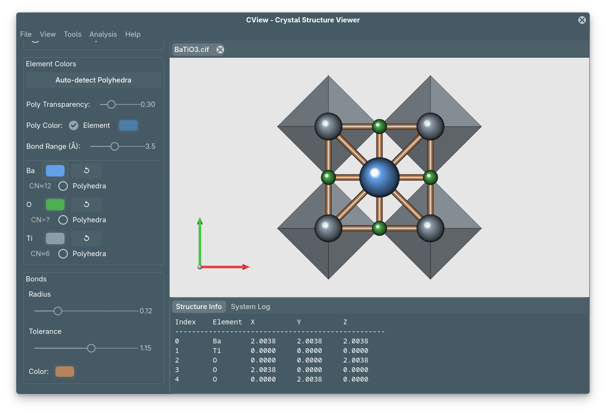

# CView: Crystal Structure Visualization & Analysis


**CView** is a high-performance crystallographic tool written in **Rust** and **GTK4**. It bridges the gap between structure visualization and *ab-initio* calculation setup (VASP, QE, SPRKKR).

```admonish note title="Philosophy"
CView is not just a viewer; it is a **pre-calculation validator**. It focuses on Reciprocal Space and Geometric consistency to prevent wasted CPU hours on incorrect VASP/QE inputs.
```



---

## ⚡ Why CView?

| Feature | Description |
| :--- | :--- |
| **🚀 Fast & Lightweight** | Built on Rust/GTK4. No GPU drivers required. Runs on any laptop. |
| **⚛️ Analysis First** | Dedicated tools for [K-Paths](guide/kpath.md), [Slabs](guide/slabs.md), and [Void Analysis](guide/voids.md). |
| **🛠️ DFT Ready** | Native support for VASP, Quantum Espresso, and SPRKKR formats. |
| **📸 Publication Quality** | Export high-resolution, transparent PNGs and PDFs using PBR rendering. |

---

## 📚 Documentation Overview

This manual is divided into three parts:

1.  **[Installation](installation.md)**: Get CView running on Linux, Windows, or macOS.
2.  **[User Guide](guide/analysis.md)**: Deep dive into the scientific methodology.
    * **[K-Path Visualization](guide/kpath.md)**: Brillouin zone construction and HSP selection.
    * **[XRD Simulation](guide/xrd.md)**: Structure factors and powder diffraction patterns.
    * **[Surface Slabs](guide/slabs.md)**: Creating vacuum-padded slabs for surface science.
3.  **[Tutorials](tutorials/bi2se3.md)**: Step-by-step walkthroughs for real materials (e.g., Bi₂Se₃).

---

## 🚀 Quick Start

Get up and running in seconds.

````admonish success title="Installation"
```
# Clone and Run
git clone https://github.com/mavensgroup/cview.git
cd cview
cargo run --release
```
````

See the [Installation Page](installation.md) for detailed OS-specific instructions.

---

## 📂 Supported Formats

Format | VASP | Quantum Espresso | SPRKKR | CIF / XYZ |
| :--- | :---: | :---: | :---: | :---: |
| **Read** | 🟢 | 🟢 | 🟢 | 🟢 |
| **Write** | 🟢 | 🟠 | 🟠 | 🟢 |
| **Relaxation** | 🟢 | 🟢 | 🔴 | 🔴 |

---

## 📜 License & Citation

**CView** is open-source software licensed under the **LGPLv3**.

If you use CView in your research, please cite the [repository](https://github.com/mavensgroup/cview).
